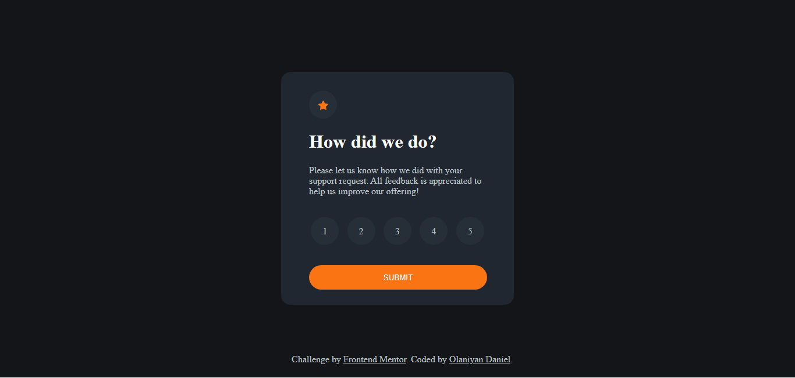
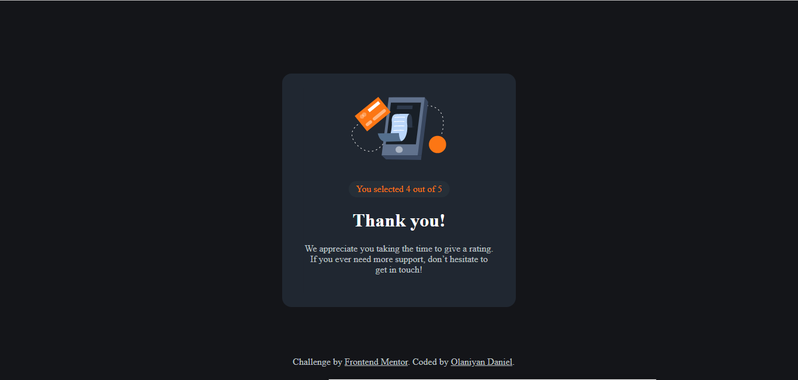

# Frontend Mentor - Interactive rating component solution

This is a solution to the [Interactive rating component challenge on Frontend Mentor](https://www.frontendmentor.io/challenges/interactive-rating-component-koxpeBUmI). Frontend Mentor challenges help you improve your coding skills by building realistic projects. 

## Table of contents

- [Overview](#overview)
  - [The challenge](#the-challenge)
  - [Screenshot](#screenshot)
  - [Links](#links)
- [My process](#my-process)
  - [Built with](#built-with)
  - [What I learned](#what-i-learned)
  - [Continued development](#continued-development)
  - [Useful resources](#useful-resources)
- [Author](#author)
- [Acknowledgments](#acknowledgments)

## Overview
I began learning Frontend. So my mentor Mr. Tope reffered me to Frontendmentor.io to complete the challenge
### The challenge

Users should be able to:

- View the optimal layout for the app depending on their device's screen size
- See hover states for all interactive elements on the page
- Select and submit a number rating
- See the "Thank you" card state after submitting a rating

### Screenshot




### Links

- Solution URL: [https://github.com/danielzion/FrontEndMentor/tree/main/interactive-rating-component-main]
- Live Site URL: [Add live site URL here](https://your-live-site-url.com)

## My process

### Built with

- Semantic HTML5 markup
- CSS custom properties
- Flexbox
- CSS Grid

### What I learned

```css
@media only screen and (min-width: 376px) {
}

.inner {
    position: fixed;
    top: 50%;
    left: 50%;
    transform: translate(-50%, -50%);
}
```
```js
The entire js
```

### Continued development

js
media query and Responsive CSS
difference between em, rem % and px.

### Useful resources

Most times I used css-tricks.com


## Author

- Website - [@danielolusegunolaniyan](https://www.linkedin.com/in/danielolusegunolaniyan)
- Frontend Mentor - [@@danielzion](https://www.frontendmentor.io/profile/@danielzion)
- Twitter - [@youngdollar173](https://www.twitter.com/youngdollar173)

## Acknowledgments

I am greatful to my Frontend Mentor Mr. Tope


